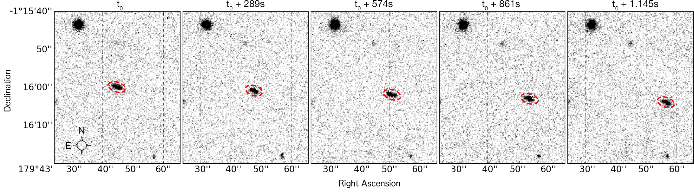

.. SSO Pipeline documentation master file, created on Thu Aug 16 17:02:11 2018

#####################
The ``ssos`` Pipeline
#####################

.. raw:: html

    <embed>
    
    

Detect, identify, and characterize known and unknown Solar System Objects (SSOs) in astronomical surveys.

Introduction to the ``ssos`` Pipeline
=====================================
The ``ssos`` Pipeline is a versatile tool to detect, identify, and characterize Solar System Objects in consecutive exposures of the sky. A large configurability allow the application of ``ssos`` to almost any kind of astronomical images, Best use cases are wide-field imaging surveys such as the `Kilo-Degree Survey <http://kids.strw.leidenuniv.nl/>`_, for which the pipeline was `originally designed <https://www.aanda.org/articles/aa/ref/2018/02/aa30924-17/aa30924-17.html>`_.

A detailed description was published in `Mahlke+ 2019 <https://arxiv.org/abs/1906.03673>`_.

The pipeline is written in ``python 3``. The three main steps are

* detecting all sources in all images using `SExtractor <https://www.astromatic.net/software/sextractor>`_
* associating sources detections between all images using `SCAMP <https://www.astromatic.net/software/scamp>`_, to build a complete source catalogue
* separating the asteroids from other sources such as stars, galaxies, artifacts using a filter chain

Additional analyses can be done, e.g. identifying known SSOs in the candidates sample by cross-matching with the `SkyBoT <http://vo.imcce.fr/webservices/skybot/>`_ database or creating cutouts for fixed-aperture magnitude extraction with `SWarp <https://www.astromatic.net/software/swarp>`_.

The strength of the pipeline lies in the large degree of versatility. All steps can be adapted to the images at hand using configuration files. The install process and the typical workflow are described in the `Getting Started <setup.html>`_.

----------------

.. toctree::
   :maxdepth: 2

   setup
   instructions
   pipeline
   misc

Acknowledgements
================

The ``ssos`` pipeline is built upon the previous work, expertise and support by many teams:

* SExtractor: Bertin, E. & Arnouts, S. 1996: SExtractor: Software for source extraction, Astronomy & Astrophysics Supplement 317, 393

* SCAMP: Bertin, E. 2006: Automatic Astrometric and Photometric Calibration with SCAMP, ASP Conference Series, Vol. 351, 2006, C. Gabriel, C. Arviset, D. Ponz, and E. Solano, eds., p. 112

* SWARP: Bertin et al. 2002: The TERAPIX Pipeline, ASP Conference Series, Vol. 281, 2002 D.A. Bohlender, D. Durand, and T.H. Handley, eds., p. 228

* This research has made use of IMCCE's SkyBoT VO tool and of the VizieR catalogue access tool, CDS, Strasbourg, France

* The KiDS survey and astroWISE team, providing the first dataset this pipeline was developed on: Based on data products from observations made with ESO Telescopes at the La Silla Paranal Observatory under programme IDs 177.A-3016, 177.A-3017 and 177.A-3018, and on data products produced by Target/OmegaCEN, INAF-OACN, INAF-OAPD and the KiDS production team, on behalf of the KiDS consortium. OmegaCEN and the KiDS production team acknowledge support by NOVA and NWO-M grants. Members of INAF-OAPD and INAF-OACN also acknowledge the support from the Department of Physics & Astronomy of the University of Padova, and of the Department of Physics of Univ. Federico II (Naples).

* This research made use of Astropy, a community-developed core Python package for Astronomy (Astropy Collaboration, 2018).

* The numpy python package: Van der Walt and Colbert 2011, Computing in Science & Engineering 13, 22

* The pandas python package: `McKinney et al. 2010 <https://www.researchgate.net/profile/Wes_Mckinney/publication/265001241_Data_Structures_for_Statistical_Computing_in_Python/links/5670827d08ae2b1f87aced0c.pdf>`_

* The sbpy python package: Mommert et al., (2019). sbpy: A Python module for small-body planetary astronomy. Journal of Open Source Software, 4(38), 1426, https://doi.org/10.21105/joss.01426

and the experts in their fields: Bruno Altieri, Emmanuel Bertin, Hervé Bouy, Benoit Carry, Enrique Solano, Gijs Verdoes-Kleijn
